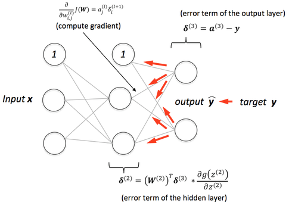
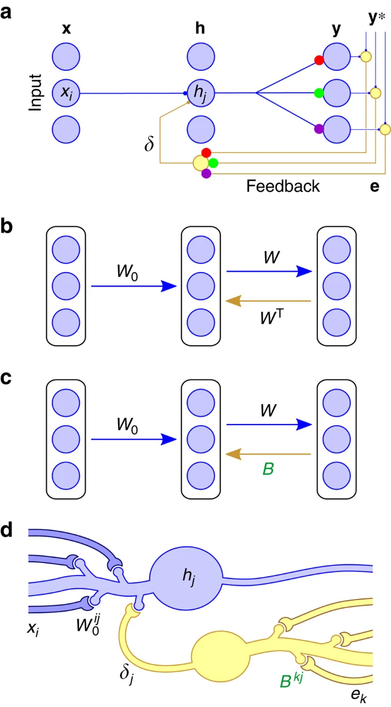
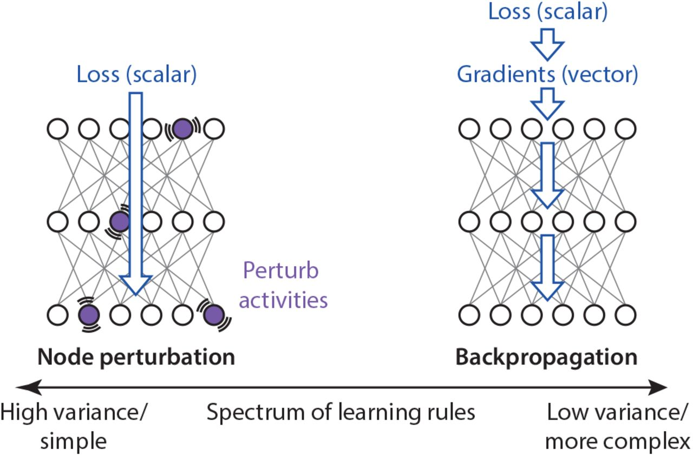
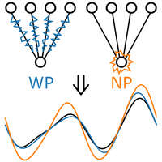

## Implementations of MicroLearning Rules!

Implementing various Bio-Plausible Learning Rules for comparison to BP algorithm.

### 1. High Precision of Synaptic Change

#### 1.1 Backprop

<!-- #### 2. TargetProp -->

### 2. Somewhere in Between

#### 2.1 Feedback Alignment

- Random synaptic feedback weights support error backpropagation for deep learning (Lillicrap et al, 2016)

### 3. Low Precision of Synaptic Change

#### 3.1 Node Pertubation

#### 3.2 Weight Pertubation
