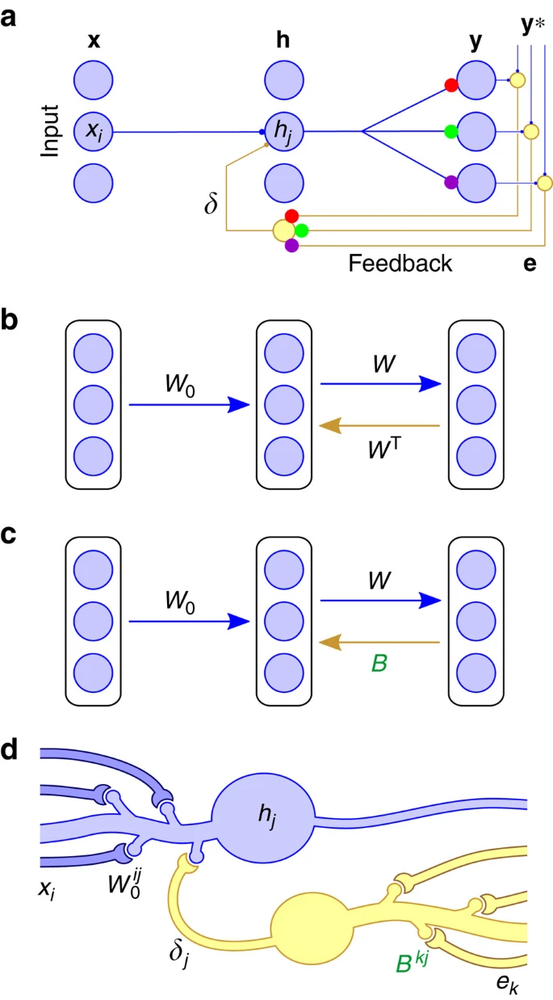

## Impementations of MicroLearning Rules!

Implementing various Bio-Plausible Learning Rules for comparison to BP algorithm.

### 1. Feedback Alignment

- Random synaptic feedback weights support error backpropagation for deep learning (Lillicrap et al, 2016)

